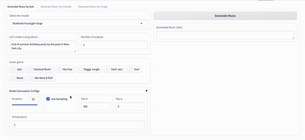
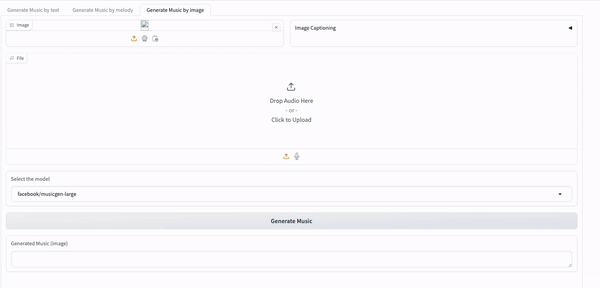
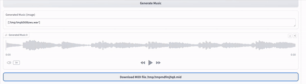
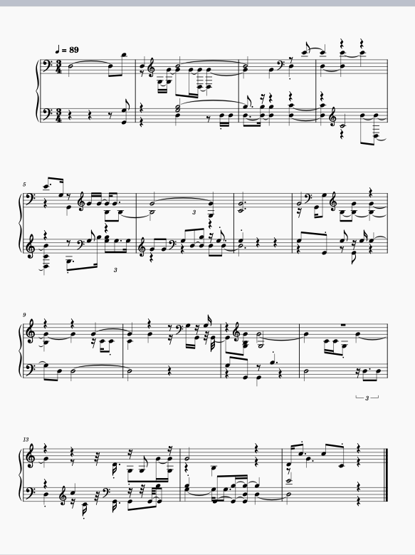

# MagicMusicMachine

## Overview
MagicMusicMachine is a demonstration of multimodal music generation technology. This application combines several cutting-edge models to transform text or images into music. It utilizes:

- **Text-to-Music Generation:** Powered by [AudioCraft](https://github.com/facebookresearch/audiocraft) from Meta, this 
  transformer-based model generates music from text prompts.
- **Music Continuation:** Powered by [MusicGen](https://github.com/facebookresearch/audiocraft/blob/main/model_cards/MUSICGEN_MODEL_CARD.md) from Meta. 
- **Image-to-Text Conversion:** Converts images into descriptive text suitable for 
  music generation. Powered by Vision API from [ChatGPT 4](https://platform.openai.com/docs/guides/vision) from OpenAI.
- **Music Transcription:** Transcribed generated music audio clips into Midi file  
  for musicians. Powered by Spotify [Basic-Pitch](https://github.com/spotify/basic-pitch).

Additionally, this app is hosted on Hugging Face Spaces, allowing users to easily interact with the model online.

## Getting Started Locally

### Prerequisites
Ensure you have `git`, `python3`, and `pip` installed on your computer.

### Installation

1. Clone the repository:
   ```shell
   git clone git@github.com:suyuchenxm/MagicMusicMachine.git
    ```

2. Navigate into the project directory:

    ``` shell
   cd MagicMusicMachine
   ```

3. Create and activate a virtual environment:
    
    ```shell
    python3 -m venv venv
    source venv/bin/activate
    pip install -r requirements.txt
    ```

### Running the app
1. To start the application, run:
    ```shell
    python app.py
    ```
2. For interactive rendering with changes, use:
    
    ```shell
    gradio run app.py
    ```

The app will be accessible at localhost:7860.

Usage
Google Colab
For an interactive demo, check out the colab notebook.

Hugging Face Spaces
The application is available on Hugging Face Spaces. The free CPU instance can run smaller models, but for larger models, cloning to your space and using an A100 GPU instance is recommended.

## Usage
### Google Colab
For an interactive demo, check out the [colab notebook](MagicMusicMachine_Colab_Demo.ipynb)

### HuggingFace Space
The application is available on [Hugging Face space](https://huggingface.co/spaces/SuriC-nyc/MagicMusicMachine). 
The free CPU instance can run smaller models, but for larger models, 
cloning to your space and using an A100 GPU instance is recommended.


### Examples
1. Text-to-Music 

Select your model available for text to music generation. After typing your prompts, you can selecet the music style or change the generation configurations such as temprature, sampling methods. 


2. Music Continuation

As a piano perfomer, I don't have the knowledge to compose or improvise a structure piece of music. Therefore, the music continuation is a dream for musician like me, who can complete your input audio or motif. 


My improvisation recording: 

Output result


3. Image to Music

Magic muisc machine allows you to generate music based on image input. It utilized ChatGPT to describe the image and generate the text prompt to MusicGen. You can provide the melody as music conditioning, so the output music will based on your melody prompt. 

Besides generating music, AudioCraft also provides model to generate the sound effects. 



4. Audio Transcription 

Magic Muisc Machine is designed to allow musician, music learner, performer be able to play the music generated or co-created by machine. Therefore, lastly I used Basic Pitch from Spotify to transcribe the audio to midi, which can be rendered as score using scoring software like Muscore. 



Generated Music:

Music Piano Score:


