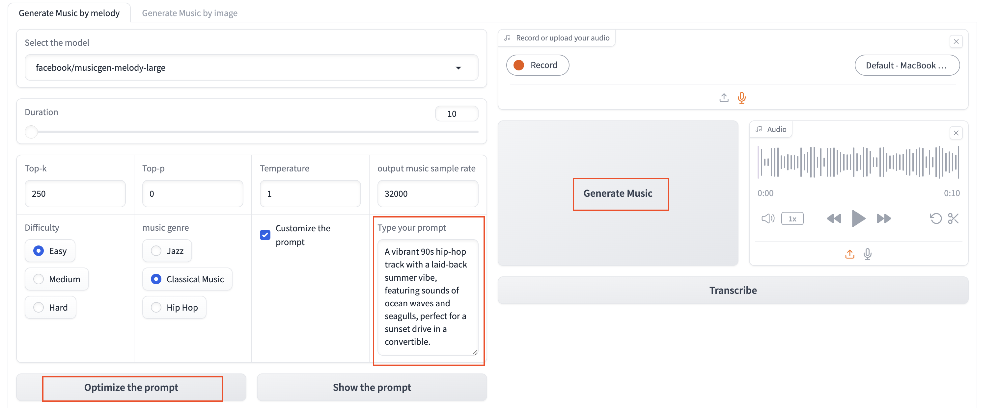

# MagicMusicMachine

## Overview
MagicMusicMachine is a demonstration of multimodal music generation technology. This application combines several cutting-edge models to transform text or images into music. It utilizes:

- **Text-to-Music Generation:** Powered by [AudioCraft](https://github.com/facebookresearch/audiocraft) from Meta, this 
  transformer-based model generates music from text prompts.
- **Image-to-Text Conversion:** Converts images into descriptive text suitable for 
  music generation. Powered by image [Claude 3](https://www.anthropic.com/api) from Anthropic AI.
- **Music Transcription:** Translates generated music audio clips into sheet music 
  for musicians. Powered by Spotify [Basic-Pitch](https://github.com/spotify/basic-pitch).

Additionally, this app is hosted on Hugging Face Spaces, allowing users to easily interact with the model online.

## Getting Started Locally

### Prerequisites
Ensure you have `git`, `python3`, and `pip` installed on your computer.

### Installation

1. Clone the repository:
   ```shell
   git clone git@github.com:suyuchenxm/MagicMusicMachine.git
    ```

2. Navigate into the project directory:

    ``` shell
   cd MagicMusicMachine
   ```

3. Create and activate a virtual environment:
    
    ```shell
    python3 -m venv venv
    source venv/bin/activate
    pip install -r requirements.txt
    ```

### Running the app
1. To start the application, run:
    ```shell
    python app.py
    ```
2. For interactive rendering with changes, use:
    
    ```shell
    gradio run app.py
    ```

The app will be accessible at localhost:7860.

Usage
Google Colab
For an interactive demo, check out the colab notebook.

Hugging Face Spaces
The application is available on Hugging Face Spaces. The free CPU instance can run smaller models, but for larger models, cloning to your space and using an A100 GPU instance is recommended.

## Usage
### Google Colab
For an interactive demo, check out the [colab notebook](MagicMusicMachine_Colab_Demo.ipynb)

### HuggingFace Space
The application is available on [Hugging Face space](https://huggingface.co/spaces/SuriC-nyc/MagicMusicMachine). 
The free CPU instance can run smaller models, but for larger models, 
cloning to your space and using an A100 GPU instance is recommended.


### Examples
1. Text-to-Music 

select `customize the prompt` and use `optimize the prompt` to improve your text input



3. Text to Music conditioning on audio input

You could generate the music by providing both text prompt and melodies, the model 
will generate the music based on your text and audio style.


4. Image to Music

Providing the image and click `submit`. You should wait for the button `generate music` to be enabled. 
Then you could click the button to generate the music based on the image.


5. Image to Music conditioning on audio input

You could also provide both image and audio input to generate the music based on the image and audio style.


6. Generate audio effect

To generate audio effect, please use the `AudioGen` model.


