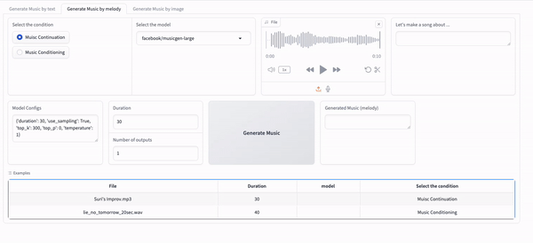

# MagicMusicMachine

## Overview
MagicMusicMachine is a demonstration of multimodal music generation technology. This application combines several cutting-edge models to transform text or images into music. It utilizes:

- **Text-to-Music Generation:** Powered by [AudioCraft](https://github.com/facebookresearch/audiocraft) from Meta, this 
  transformer-based model generates music from text prompts.
- **Music Continuation:** Powered by [MusicGen](https://github.com/facebookresearch/audiocraft/blob/main/model_cards/MUSICGEN_MODEL_CARD.md) from Meta. 
- **Image-to-Text Conversion:** Converts images into descriptive text suitable for 
  music generation. Powered by Vision API from [ChatGPT 4](https://platform.openai.com/docs/guides/vision) from OpenAI.
- **Music Transcription:** Transcribed generated music audio clips into Midi file  
  for musicians. Powered by Spotify [Basic-Pitch](https://github.com/spotify/basic-pitch).

Additionally, this app is hosted on Hugging Face Spaces, allowing users to easily interact with the model online.

## Getting Started Locally

### Prerequisites
Ensure you have `git`, `python3`, and `pip` installed on your computer.

### Installation

1. Clone the repository:
   ```shell
   git clone git@github.com:suyuchenxm/MagicMusicMachine.git
    ```

2. Navigate into the project directory:

    ``` shell
   cd MagicMusicMachine
   ```

3. Create and activate a virtual environment:
    
    ```shell
    python3 -m venv venv
    source venv/bin/activate
    pip install -r requirements.txt
    ```

### Running the app
1. To start the application, run:
    ```shell
    python app.py
    ```
2. For interactive rendering with changes, use:
    
    ```shell
    gradio run app.py
    ```

The app will be accessible at localhost:7860.

Usage
Google Colab
For an interactive demo, check out the colab notebook.

Hugging Face Spaces
The application is available on Hugging Face Spaces. The free CPU instance can run smaller models, but for larger models, cloning to your space and using an A100 GPU instance is recommended.

## Usage
### Google Colab
For an interactive demo, check out the [colab notebook](MagicMusicMachine_Colab_Demo.ipynb)

### HuggingFace Space
The application is available on [Hugging Face space](https://huggingface.co/spaces/SuriC-nyc/MagicMusicMachine). 
The free CPU instance can run smaller models, but for larger models, 
cloning to your space and using an A100 GPU instance is recommended.


### Examples
1. Text-to-Music 

Select a model for text-to-music generation. After entering your prompts, you can choose the music style or adjust the generation settings, such as temperature and sampling methods.


2. Music Continuation

As a piano performer, I don't have the knowledge to compose or improvise a structured piece of music. That's why music continuation is a dream for musicians like me -- it allows you to complete your input audio or motif seamlessly.




My improvisation recording: 


https://github.com/user-attachments/assets/44245076-ec97-464d-bd44-e3ccfc728f80


Output result


https://github.com/user-attachments/assets/0abd7591-4a1c-45ab-867a-6aacb1986733


3. Image to Music

Magic Music Machine lets you generate music from an image input. It uses ChatGPT to describe the image and create a text prompt for MusicGen. You can also provide a melody as a conditioning input, allowing the generated music to be based on your melody.

In addition to music generation, AudioCraft offers models to generate sound effects.


4. Audio Transcription 

Magic Music Machine is designed to enable musicians, music learners, and performers to play music that is generated or co-created by AI. To make this possible, I used Basic Pitch from Spotify to transcribe the audio into MIDI, which can then be rendered as a score using software like [MuseScore](https://musescore.org/en). 


Generated Music:


https://github.com/user-attachments/assets/79a4f8c2-11ee-434c-8f37-ddcb4317bf91


Music Piano Score:


